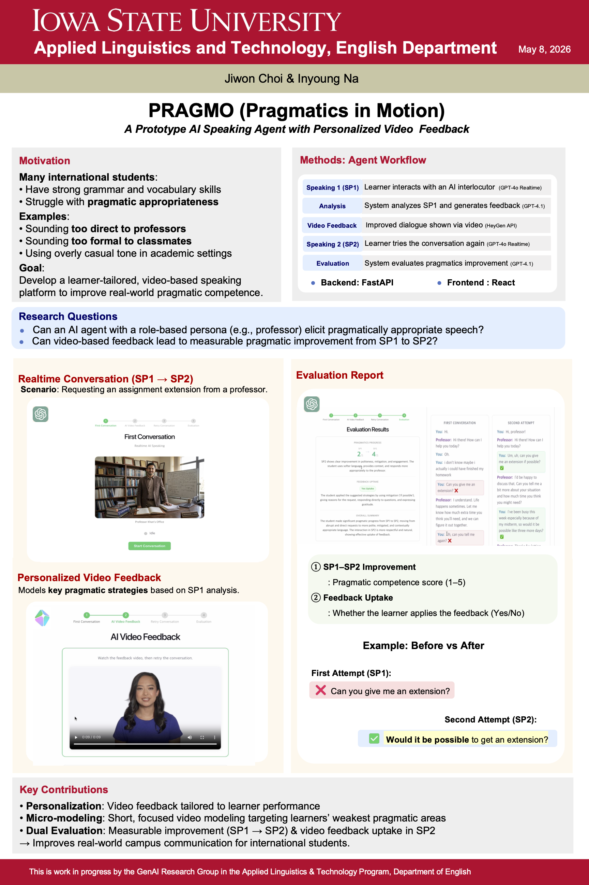

# PRAGMO (Pragmatics in Motion)

PRAGMO is a real-time multimodal conversational AI system for L2 speaking practice.

The system integrates:
- GPT-4o Realtime voice interaction
- automated pragmatic analysis
- AI-generated personalized video feedback
- SP1 → SP2 learning evaluation workflows

Built with FastAPI, React, OpenAI Realtime API, and HeyGen.

---

## Demo Video

[Demo Video Link]

---

## Poster Overview



---

## System Overview

PRAGMO supports interactive roleplay-based speaking practice through real-time AI conversation and personalized multimodal feedback.

The workflow consists of:

1. **SP1 (Initial Interaction)**  
   The learner participates in a real-time conversation with an AI interlocutor.

2. **Automated Pragmatic Analysis**  
   The system analyzes pragmatic appropriateness, including:
   - contextual appropriateness
   - tone and politeness
   - mitigation and phrasing
   - response appropriateness

3. **AI-Generated Video Feedback**  
   Personalized reenacted feedback videos are automatically generated using AI avatars.

4. **SP2 (Reattempt Interaction)**  
   The learner retries the conversation after receiving feedback.

5. **Evaluation Pipeline**  
   The system evaluates pragmatic improvement and feedback uptake between SP1 and SP2.

---

## Architecture

### Backend
- FastAPI
- WebSocket streaming
- ffmpeg audio processing
- Session orchestration pipeline

### Frontend
- React
- Real-time audio interaction UI

### AI / LLM
- GPT-4o Realtime API
- GPT-4.1
- Prompt-based pragmatic evaluation

### Multimedia
- HeyGen API
- AI avatar video generation

---

## Core Features

- Real-time multimodal conversational interaction
- Streaming audio pipeline using WebSockets
- Automated transcript collection
- Pragmatic appropriateness analysis
- Evidence-based feedback generation
- AI-generated reenacted feedback videos
- SP1 → SP2 evaluation framework
- Structured JSON-based evaluation outputs
- Session result persistence

---

## Research Focus

PRAGMO explores multimodal AI feedback workflows for conversational language learning, focusing on pragmatic appropriateness, personalized feedback generation, and AI-mediated interaction.

---

## Example Scenario

- Requesting an assignment extension from a professor
- Navigating socially appropriate academic communication
- Improving tone, mitigation, and response strategies

---

## Tech Stack

| Category | Technologies |
|---|---|
| Backend | FastAPI, Python, WebSockets |
| Frontend | React |
| AI Models | GPT-4o Realtime API, GPT-4.1 |
| Multimedia | HeyGen API |
| Audio Processing | ffmpeg |
| Data Handling | JSON session storage |

---

## Project Structure

```text
PRAGMO/
├── backend/
│   ├── config/
│   ├── services/
│   ├── main.py
│   └── requirements.txt
│
├── frontend/
│   ├── src/
│   └── package.json
│
├── assets/
│   └── pragmo_poster.png
│
├── README.md
└── .gitignore
```

---

## Repository Status

This repository is currently being cleaned and updated as development continues.

Additional documentation and refactoring are in progress.

---

## Citation

If you use or reference this project, please cite the associated research work appropriately.